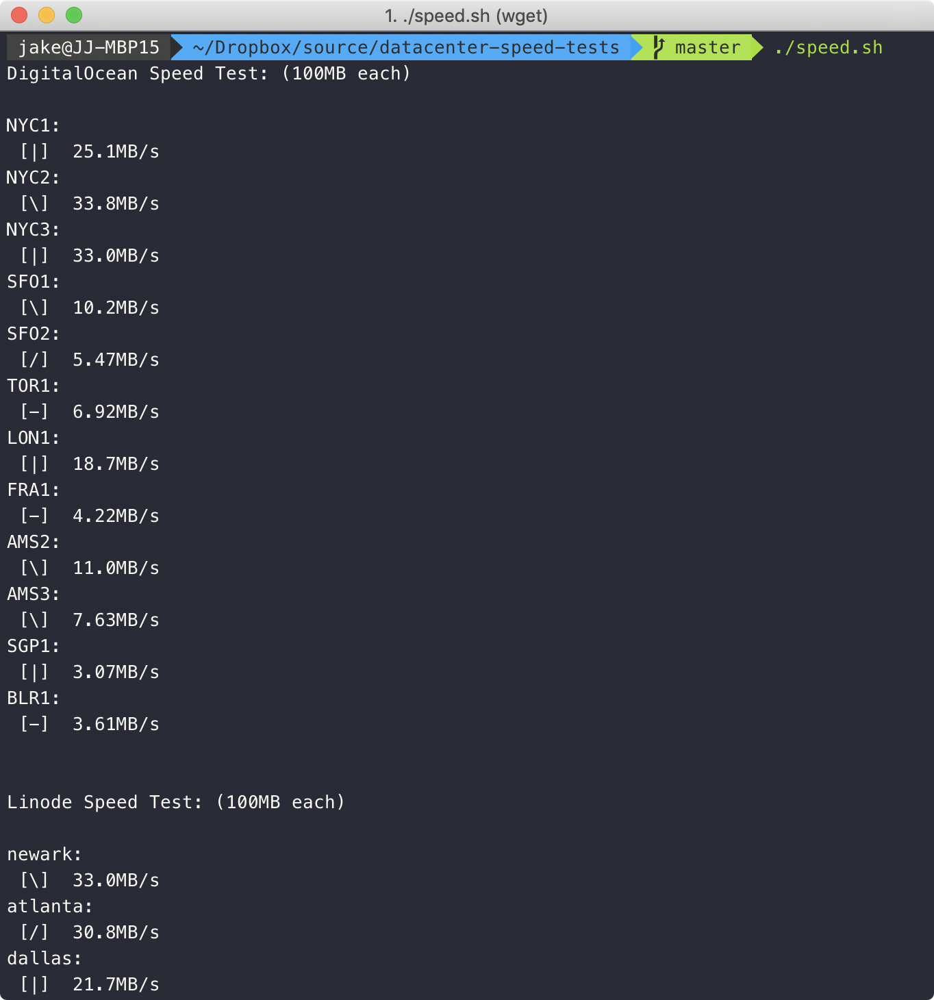
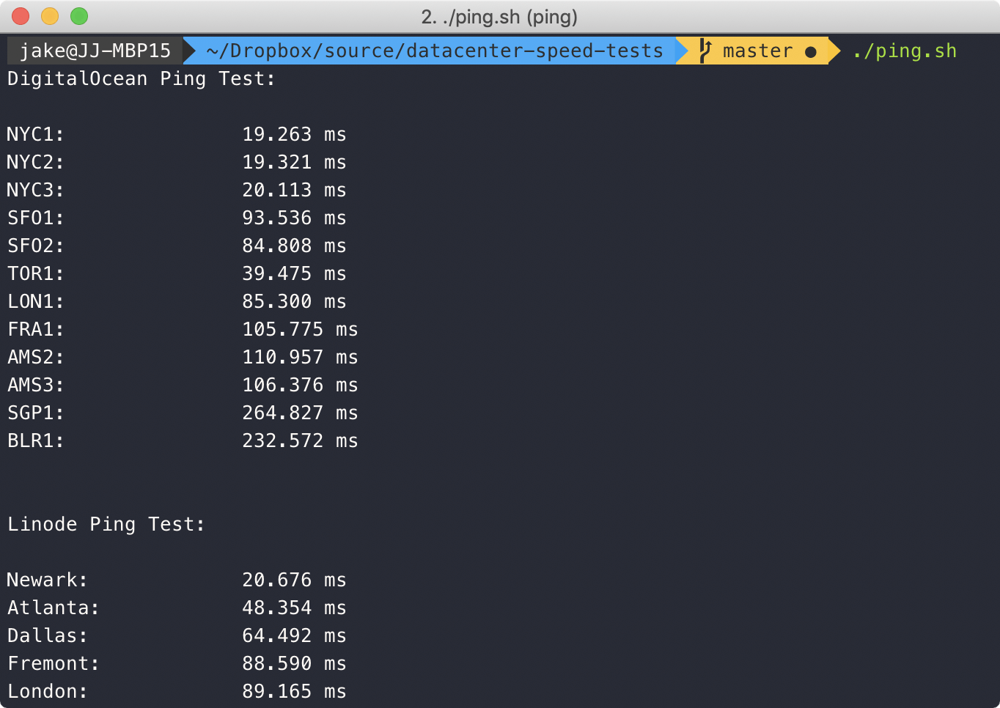

# Speed & Ping Tests for Cloud Hosting Providers

### Notes:

- Speed tests for ***each data center*** can use up to **100MB of data**. Be careful if your ISP caps your data usage!
- Files are downloaded via HTTP (not HTTPS) to get pure speed without encryption overhead.
- If it looks like the script has crashed, the current test is probably just taking a while — especially when testing far-away regions. If you already know that testing other continents is futile, just remove them from the for loops in `speed.sh`.
- AWS and GCP tests courtesy of [CloudHarmony](https://cloudharmony.com/).
- Tests can always be influenced by outside variables. Run the scripts multiple times if you want to ensure accuracy. Obviously, evil throttling ISPs can mess up the results too.

### Usage:

If you trust me, these commands will download and run the scripts automatically:

```
wget -qO - https://raw.githubusercontent.com/jakejarvis/datacenter-speed-tests/master/ping.sh | bash
wget -qO - https://raw.githubusercontent.com/jakejarvis/datacenter-speed-tests/master/speed.sh | bash
```

Or, clone the repository and make sure you make the scripts executable before running:

```
git clone https://github.com/jakejarvis/datacenter-speed-tests.git
cd datacenter-speed-tests
chmod +x ping.sh && chmod +x speed.sh
./ping.sh
./speed.sh
```

### Data centers:

Scripts will test speed and pings to the following data centers:

**DigitalOcean:** [(locations)](https://www.digitalocean.com/docs/platform/availability-matrix/#datacenter-regions)

- NYC1
- NYC2
- NYC3
- SFO1
- SFO2
- SFO3
- TOR1
- LON1
- FRA1
- AMS2
- AMS3
- SGP1
- BLR1

**Linode:** [(locations)](https://www.linode.com/linodes#features-dc-container)

- Newark
- Atlanta
- Dallas
- Fremont
- London
- Frankfurt
- Singapore
- Tokyo
- Sydney
- Toronto
- Mumbai

**Amazon Web Services:** [(locations)](https://docs.aws.amazon.com/AmazonRDS/latest/UserGuide/Concepts.RegionsAndAvailabilityZones.html)

- us-east-1
- us-east-2
- us-west-1
- us-west-2
- ca-central-1
- eu-north-1
- eu-central-1
- eu-west-1
- eu-west-2
- eu-west-3
- eu-south-1
- ap-northeast-1
- ap-northeast-2
- ap-northeast-3
- ap-south-1
- ap-southeast-1
- ap-southeast-2
- ap-east-1
- sa-east-1
- me-south-1
- af-south-1

**Google Cloud:** [(locations)](https://cloud.google.com/compute/docs/regions-zones/)

- us-east1
- us-east4
- us-west1
- us-west2
- us-west3
- us-central1
- northamerica-northeast1
- asia-east1
- asia-east2
- asia-northeast1
- asia-northeast2
- asia-south1
- asia-southeast1
- australia-southeast1
- europe-north1
- europe-west1
- europe-west2
- europe-west3
- europe-west4
- europe-west6
- southamerica-east1

**Vultr/Choopa:** [(locations)](https://www.vultr.com/locations/)

- nj-us
- il-us
- ga-us
- fl-us
- tx-us
- sjo-ca-us
- lax-ca-us
- wa-us
- tor-ca
- fra-de
- ams-nl
- par-fr
- lon-gb
- syd-au
- sgp
- hnd-jp
- sel-kor

### Screenshots:




---

Inspired by https://www.reddit.com/r/webdev/comments/6ylmki/heres_an_easy_way_to_find_the_nearest/